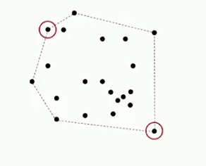

# Week2.2：Elementary Sorts

## 排序需要解决的问题
- 如何实现一个排序程序，可以被多个不同的客户端用来对不同数据类型进行排序。
	- 回调：将函数作为实参传递给其他函数，在Java使用了接口的实现方式。
	- 对象实现Comparable接口的compareTo()方法。
	- compareTo(Item item)：用来表示当前对象与参数对象进行比较
		- -1表示小于
		- +1表示大于
		- 0表示等于
	- compareTo(Item item)中item为null，则抛出异常
	- 辅助函数：
		- less(A, B)
		- swap()

## 全序关系（能够排序需要满足的条件）：
- 如果v <= w 并且 w <= v,那么 v = w。
- 如果v <= w 并且 w <= 	x,那么v <= x。
- 要么v <= w,要么w <= v。

## 选择排序（Selection Sort）
- 在第i次迭代中，在数组中第i项右边剩下的项（包括第i项）中找到最小的一项，然后和第i项进行交换。
- 不变式：指针左边的元素都比右边的元素小。
- N次交换，N^2/2次比较。
- 时间效益与输入的序列本身顺序无关，因为它总是要查看所有项寻找最小项。
- 交换顺序与N线性相关。

## 插入排序（Insertion Sort）
- 在第i次迭代中，将第i项插入到左边排好序的序列中的指定位置。
- 不变式：指针左边的所有元素（包括指针位置的元素）都是排好序的。
- 平均情况下：1/4 N^2比较，1/4 N^2交换
- 插入排序的运行时间，取决于数据的顺序。
- 插入排序的交换次数与序列逆序数相等。
- 选择排序因为是交换元素（更耗时），而不是标记，所以某些情况下运行时间比较慢。

## 希尔排序（Shell Sort）
- 希尔排序是基于插入排序的。
- 插入排序效率低的原因是因为每次交换只向前移动一个位置，而实际上，那些元素应该移动更多的位置的。
- 希尔排序的思想是将数组若干项移动若干位置。
- 每次排序基于前面排序的实现，只需要进行少数几次的交换。
- 原理：（h-插入排序）
	- 若是增量h很大，进行排序的子数组长度就很小。
	- 若是增量h很小，因为之前已经使用了更大的h值进行了h-排序，数组是部分有序的，插入排序就很快。
- g-有序的数组经过h-排序后，依然是g-有序的。
- 增量的选择（h）：
	- 3x+1  （易于计算）（x是增量序列的前一个值）
	- 效率大概是N^(3/2)
	- 找到小于数组长度最大的增量值，然后依照递减的增量值进行排序。
- 使用该算法的原因：
	- 思想简单，但是能够获得巨大的性能提升。
	- 该算法通常用于嵌入式系统或硬件排序类的系统，因为实现它只需要很少的代码。
	- 开发算法的智力挑战：开发一个增量序列。

## 洗牌（Shuffling）
- 均匀洗牌
- 利用排序实现洗牌算法
	- 为每张牌产生一个随机数，然后进行排序。
- 简单实现（线性时间）
	- 从前往后，对于当前i，取Random(i)位置的元素与i位置的元素进行交换。
	- 从后往前，对于当前i，取Random(i)位置的元素与i位置的元素进行交换。

##凸包（Convex Hull）
- 还未实现。
- 凸包：是包含所有点的最小的凸状点集合
- 在每个点扎上图钉，然后用一根带子将所有的钉子围起来收紧，就可以得到这个点集的凸包。
- 凸包的相关应用：
	- 求出A到B的最短距离
		
	- 点集中相距最远的两个点
		
- **凸包的几何特性**
	- 只能用逆时针或者是左转的方式来穿过凸包
	- 选定y坐标最小的点p，从p点指向每个点，每个点的极角值是递增的。
	

- **葛立恒扫描法：（求解凸包问题）（基于凸包的两个几何特性）**
	- 1.获取y坐标值最小的点p
	- 2.将p点作为起始点，按照以p为起点的极角从小到大进行排序。
	- 3.舍弃那些无法产生逆时针旋转的点。
	
- 如何判断三点a->b->c是逆时针还是顺时针。
```
    /**
     * Returns true if a→b→c is a counterclockwise turn.
     * @param a first point
     * @param b second point
     * @param c third point
     * @return { -1, 0, +1 } if a→b→c is a { clockwise, collinear; counterclocwise } turn.
     */
    public static int ccw(Point2D a, Point2D b, Point2D c) {
        double area2 = (b.x-a.x)*(c.y-a.y) - (b.y-a.y)*(c.x-a.x);
        if       (area2 < 0) return -1;
        else if  (area2 > 0) return +1;
        else                return  0;
    }
```

- 一旦有了一个好算法，当我们遇到另一个问题的时候，我们就可以想一想，我们已经有了一个好算法，那么我们可不可以用它来解决新问题。
- [视频链接](https://www.coursera.org/learn/algorithms-part1/lecture/KHJ1t/convex-hull)和[Point2D代码实现](https://algs4.cs.princeton.edu/12oop/Point2D.java.html)