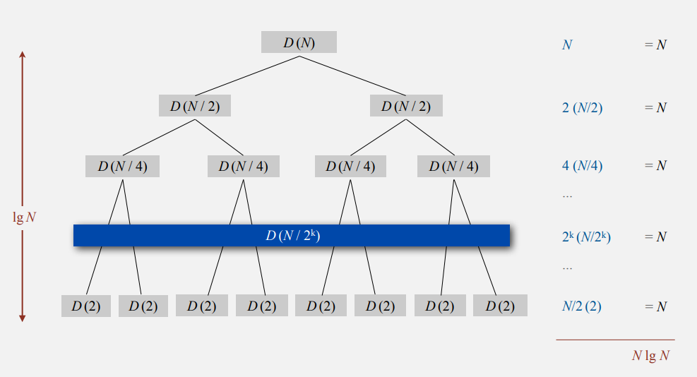
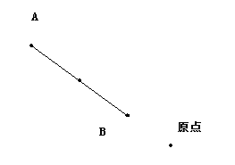

# Week3.1：MergeSort


## 归并排序
> 冯诺依曼是归并排序的创始人。

- assert的使用：

  - assert的使用：不仅用来发现漏洞，同时也用来提供之间代码的功能。
  - assert接受一个boolean值，在验证到时false将会抛出异常
  - assert默认是禁用的（禁用时编译后没有assert）

- 归并排序实现的思想：

  - 归并排序使用了辅助数组，用来暂存需要进行合并的两个部分
  - 归并排序使用分治的思想：将一段序列进行排序分成了两个序列进行排序，然后再进行合并

- 归并排序的特性：

  - 需要N的额外空间(非原地排序)
  - 时间复杂度为NlogN
  - 稳定排序

- 归并排序的效率分析（NlogN）
  - D(N) = 2D(N/2) + N ，且 D(1) = 0  (其中D(N)代表N个元素的比较次数)

  - 证明1：

    ```
    D(N) = 4D(N/4) + N + 2(N/2)
    D(N) = 8D(N/8) + N + 2(N/2) + 4(N/4)
    ...logN(次)
    D(N) = D(1) + N + 2(N/2) + 4(N/4) +...+ (N/2)2
    得D(N) = NlogN
    ```

    

  - 证明2：

    ```
    D(N)/N = 2D(N/2)/N + 1
    D(N)/N = D(N/2)/(N/2) + 1
    ...
    D(N)/N = D(N/N)/(N/N) + 1 + 1 + 1 +... + 1
    D(N)/N = logN
    ```

  - 证明3：（数学归纳法）

    ```
    假如对于N成立
    D(2N) = 2D(N) + 2N
    D(2N) = 2NlogN + 2N
    D(2N) = 2Nlog(2N) - 2N + 2N
    D(2N) = (2N)log(2N)
    对于2N也成立
    ```

- 归并排序的实现：

  ```java
  //调用接口
  public static void sort(Comparable[] a) {
      Comparable[] aux = new Comparable[a.length];
      sort(a, aux, 0, a.length-1);
  }

  //递归排序
  private static void sort(Comparable[] a, Comparable[] aux, int low, int hig) {
      if (low >= hig)  return;
      int mid = low + (hig - low)/2;
      sort(a, aux, low, mid);
      sort(a, aux, mid+1, hig);
      merge(a, aux, low, mid, hig);
  }

  //合并（借助aux辅助数组）
  private static void merge(Comparable[] a, Comparable[] aux, int low, int mid, int hig) {
      for (int i = low; i <= hig; i++) aux[i] = a[i];
      
      int left = low, right = mid+1;
      for (int i = low; i <= hig; i++) {
          if (left > mid) 						a[i] = aux[right++];
          else if (right > hi) 					a[i] = aux[left++];
          else if (less(aux[right], aux[left])) a[i] = aux[right++];
          else 									a[i] = aux[left++];
      }
  }

  //判断a是否小于b
  private static boolean less(Comparable a, Comparable b) {
      return a.compareTo(b) < 0;
  }

  ```


- 优化归并排序：

  - 对于小部分分组使用插入排序进行排序。(归并排序对于小数组有过多的开销)

    ```java
    private static final int LOW_LENGTH = 7;
    //递归排序
    private static void sort(Comparable[] a, Comparable[] aux, int low, int hig) {
        if (hig - low + 1 <= LOW_LENGTH) {
            Insert.sort(a, low, hig);
        	return ;
        }
        int mid = low + (hig - low)/2;
        sort(a, aux, low, mid);
        sort(a, aux, mid+1, hig);
        merge(a, aux, low, mid, hig);
    }
    ```

  - 如果进行合并的时候两个数组已经是排好序的，就不需要进行合并操作了。

    ```java
    //递归排序
    private static void sort(Comparable[] a, Comparable[] aux, int low, int hig) {
    	if (low >= hig) return ;
        int mid = low + (hig - low)/2;
        sort(a, aux, low, mid);
        sort(a, aux, mid+1, hig);
        if (less(a[mid],a[mid+1]))	return ;
        merge(a, aux, low, mid, hig);
    }
    ```

  - 在拷贝数组的内容的时候，互换原数组和辅助数组的角色。（原数组的左右两个部分排好序放到辅助数组中，然后再将辅助数组中的两部分合并到a中）

    ```java
    //排序
    public static void sort(Comparable[] a) {
        Comparable[] aux = new Comparable[a.length];
        //添加部分
        for (int i = 0; i < a.length; i++)
            aux[i] = a[i];
        sort(a, aux, 0, a.length-1);
    }	
    	
    //将aux中的数据进行排序后放到a中
    private static void sort(Comparable[] a, Comparable[] aux, int low, int hig) {
        if (low == hig)  return ; 
        int mid = low + (hig - low) / 2;

        //修改部分
        sort(aux, a, low, mid);
        sort(aux, a, mid+1, hig);
        merge(aux, a, low, mid, hig);
    }

    //合并(将排好序的aux，合并到a中)
    private static void merge(Comparable[] aux, Comparable[] a, int low, int mid, int hig) {
        //删除了复制操作
        int left = low, right = mid+1;
        for (int i = low; i <= hih; i++) {
            if 		(left > mid) 					a[i] = aux[right++];
            else if (right > hig) 					a[i] = aux[left++];
            else if (less(aux[right], aux[left])) 	a[i] = aux[right++];
            else 									a[i] = aux[left++];
        }
    }
    ```

## 归并排序的自下而上（非递归实现）
- 把一个大小为N的序列分成大小为1的N个子序列，第一次合并相邻两个（1和1），第二次合并（2和2），第三次（4和4）...

  ```java
  public static void sort(Comparable[] arr) {
      Comparable[] aux = new Comparable[arr.length];

      //len代表着每个分组的长度
      for (int len = 1; len < arr.length; len = 2*len) {
          //low代表着开始的位置，mid代表着中间的位置，hig代表着结束的位置
          for (int low = 0; low < arr.length-len; low += 2*len) {
              int hig = Math.min(low+2*len-1, arr.length-1);
              int mid = low + len - 1;
              merge(arr, aux, low, mid, hig);
          }
      }
  }
  ```


## 排序复杂度

- 计算复杂度
  - 计算模型：可以进行的操作
  - 成本模型：操作次数
  - 上界：保证消耗成本不会超过该界限
  - 下界：没有算法可以做的更好
  - 最佳算法：上界和下界时相同的算法
- 排序的复杂度：
  - 计算模型：决策树
  - 成本模型：比较
  - 上界：NlogN （mergesort）
  - 下界：？
  - 最优算法：？

## 比较器

- Comparator接口
- 作用：实现对一种数据的多种排序方式

## 稳定性

- 一个稳定的排序是指保留了有用相同关键字记录的相对顺序
- 选择，希尔排序不是稳定的。
- 归并，插入排序是稳定的。
- 作用：能够保证在A相同的情况下，根据B进行排序。（先根据B进行排序，然后再根据A进行排序，根据A排序的排序算法必须是稳定的）


---

# Assigment
[Programming Assignment 3: Pattern Recognition](http://coursera.cs.princeton.edu/algs4/assignments/collinear.html)

## 实现分析

- Point类：

  - slopeTo：
    - 同一点时：取负无穷
    - x坐标相等：正无穷
    - y坐标相等：+0（存在-0）
  - compareTo：
    - 先根据y坐标比较
    - y坐标相等的时候才根据x坐标比较
  - slopeOrder：
    - 构建一个内部类的比较器，与当前对象相关联。
    - **可以使其他点基于该点进行比较。**

- BruteCollinearPoints类：

  - 暴力法（n^4）

  - 保证参数有效性(出错就抛出IllegalArgumentException异常)

    - 数组不为null
    - 元素不为null
    - 不存在两个相同的点

    ```java 
    //验证参数的有效性
    private static void validate(Point[] points) {
        if (points == null || points.length == 0)
            throw new IllegalArgumentException();
        for (int i = 0; i < points.length; i++) { 
            if (points[i] == null)
                throw new IllegalArgumentException();
            for (int j = i+1; j < points.length; j++) 
                if (points[j] == null || points[i].compareTo(points[j]) == 0)
                    throw new IllegalArgumentException();
        }
    }
    ```

    ​

  - **不能修改构造方法的参数，返回一个新的数组给用户，避免用户修改内部数据**

    ```java
    public BruteCollinearPoints(Point[] points) {   
        validate(points);
        //创建临时数组，避免直接使用原数组
        Point[] tempPoints = copy(points);
        list = calculateLine(tempPoints);
    }
    //创建一个新的数组给用户
    public LineSegment[] segments() {               // the line segments
        return list.toArray(new LineSegment[list.size()]);
    }
    ```

  - 实现过程：

    - **对所有坐标进行排序。（保证了小的部分在下面或左边）**
    - 使用四次嵌套循环，判断斜率是否相等。
    - 端点为第一个坐标和最后一个坐标。
    - 无需重复比较，一共是4的阶乘种情况

- FastCollinearPoints类：

  - 基于排序快速的解决方案（N^2logN）

  - 参数有效性同BruteCollinearPoints类

  - 数据的独立性同BruteCollinearPoints类

  - 特殊情况：

    - 点数小于4，则一定不能形成一条线

  - 算法思想：

    **分别以每个点为原点，将它与其他点之间的斜率计算出来，进行排序。排序之后就可以地找到所有斜率相同的组合。如果斜率相同的点超过3个（加上原点自身就是4个），那就输出。**

  - 实现过程：

    - 对原坐标数组进行排序

    - 从排好序的坐标数组中顺序取一个坐标作为原点

      - 其他点根据与当前原点连线的斜率进行排序

      - 若是斜率相同则表示处于同一条线上。

      - 直到不在同一条直线上的点出现

        - 若是连续点存在4个以上且当前线段最下边的点B在坐标原点的上边，意味着

        - 连接坐标原点和最右边的点A（最大的那个点），这就是一个线段的两端

          

## 收获

- 对象内部不能修改外部的数据（创建一个新的数组，不对原数组直接进行操作）
- 外部不能修改对象内部的数据（提供一个新数组返回，而不是该对象内部使用的数组）
- **在一个对象内部返回一个与该对象有关的比较器（比较关键值与该对象有关）**
- **利用排序的稳定性保证排序后的相同值的相对位置不发生改变（可以实现多重排序，不同比较键的权重不同，后进行排序的权重大）**


